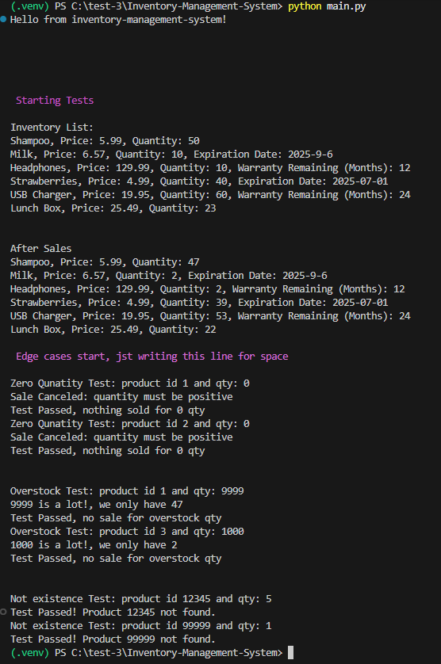

# Assignment: Inventory Management System 
### Python Fall Sem

Practicing OOP principles building terminal Inventory Management System for grocery store. 

## How to Run This application
1. git clone this repository (or extract the zip file). I use uv
2. python -m venv .venv
3. source .venv/bin/activate  (Mac/Linux) or .venv\Scripts\activate (Windows)
4. pip install -r requirements.txt (there are no dependencies but for future)
5. python main.py

